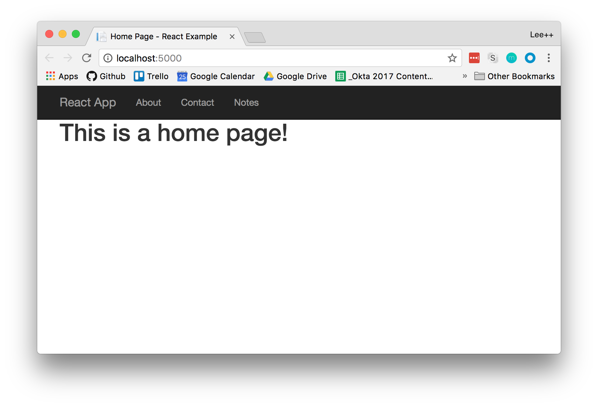

# Build a .NET Core App with React and Authentication

In today's world of Single Page Apps, it's not uncommon to have a React or Angular application that gets it's data from a .NET API back end. Getting the authentication information from the client side to the server side (and vice versa) can be somewhat daunting. This tutorial will show you how to get the two ends of your application to use the same information, making authentication seamless.

## Get The Base App
Make sure you have the .NET Framework 2.0, Node 8 or better, and NPM installed. You can start with a basic application that has .NET serving up a React app, and the API for that React app by cloning the following repository:

```bash
git clone https://github.com/oktadeveloper/okta-dotnetcore-react-example.git 
cd okta-dotnetcore-react-example
npm install
dotnet build
dotnet run
```

You should see something similar to this:



Once you have that running, make sure you have an application set up in Okta.
